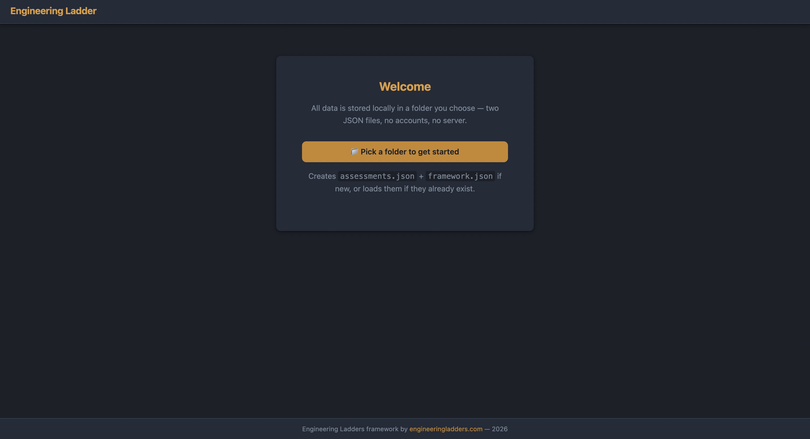
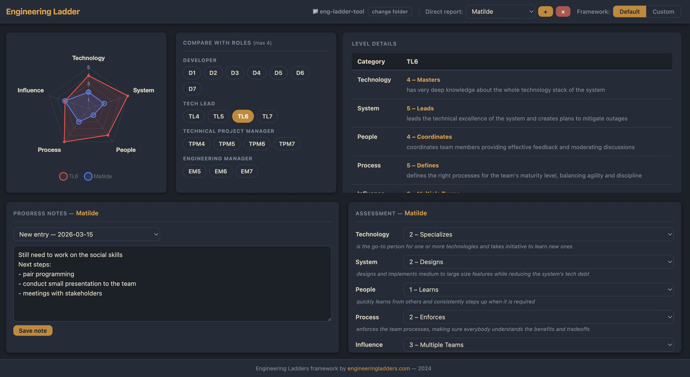
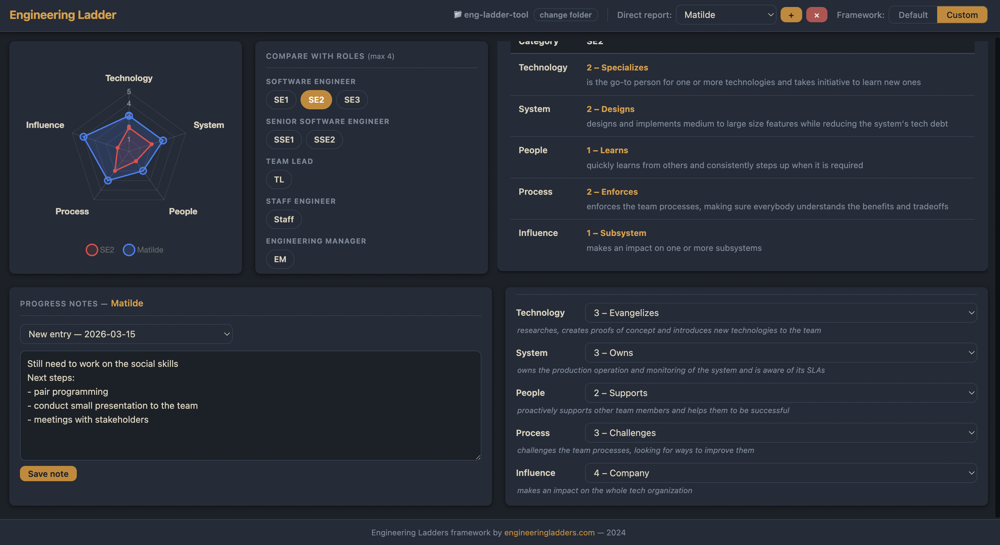

# Engineering Ladder Tool

A browser-based tool for tracking and visualizing engineering career progression against a configurable ladder framework. Built with the assistance of ClaudeCode.



---

> **Disclaimer:** This tool was developed independently as a personal project.
> It is not affiliated with, endorsed by, or in any way connected to [engineeringladders.com](https://www.engineeringladders.com/).
> The default framework bundled in `default_framework.js` is based on the structure published on that site and is included here for reference only.

---

## How to run

The tool is a plain HTML/JS/CSS app — no build step, no servers, no dependencies to install.

---

## Data folder

On first launch you'll be asked to pick a folder. The app creates two files there:

| File | Contents |
|---|---|
| `assessments.json` | Direct reports, their assessment scores, and journal entries |
| `framework.json` | Your custom framework definition (categories, levels, roles) |

The folder handle is remembered between sessions — you won't be asked to pick it again.

---

## How to use



### 1. Open a folder

Click **Open folder** on the welcome screen and select (or create) a folder on your machine. The app will create the two data files automatically.

### 2. Add direct reports

Use the **Direct report** selector in the header. Click **+** to add a name and **×** to remove one.

### 3. Pick a framework

Toggle between **Default** (read-only, from `default_framework.js`) and **Custom** (editable via `framework.json`).

To populate the custom framework for the first time, switch to Custom and click **Copy from Default Framework** — this seeds `framework.json` with the default roles and categories which you can then edit freely.

### 4. Compare against roles

Use the **Roles** panel to select up to 4 role benchmarks. They appear as colored overlays on the radar chart.

### 5. Record an assessment

With a direct report selected, use the **Assessment** drop-downs to set their current level in each category. The result appears as a blue overlay on the chart.

### 6. Write progress notes

The **Progress Notes** section at the bottom of the page is a per-user journal. Each entry is tied to a date. Use the dropdown to browse past entries (read-only). New entries are saved to `assessments.json` under the user's `journal` array.

---

## Frameworks

The **Default** framework is based on [engineering-ladders.com](https://www.engineeringladders.com/) and ships with 17 roles across 4 tracks:

| Labels | Track |
|---|---|
| D1 – D7 | Developer |
| TL4 – TL7 | Tech Lead |
| TPM4 – TPM7 | Technical Project Manager |
| EM5 – EM7 | Engineering Manager |

Ranks are defined across 5 categories: **Technology**, **System**, **People**, **Process**, and **Influence**.

The **Custom** framework lives entirely in `framework.json` and can be shaped to match your company's specific ladder.


---

## Project structure

```
v2/
├── index.html
├── main.js
├── utils.js
├── data/
│   ├── default_framework.js   ← read-only default (do not edit)
│   ├── store.js               ← file I/O and persistence
│   ├── state.js               ← in-memory app state
│   └── journal.js             ← journal helpers
├── chart/
│   └── radar.js               ← Chart.js radar chart
├── ui/
│   ├── header.js
│   ├── roles.js
│   ├── assessment.js
│   ├── levels.js
│   ├── journal.js
│   └── welcome.js
└── styles/
    ├── base.css               ← design tokens
    ├── layout.css
    ├── components.css
    ├── header.css
    ├── roles.css
    ├── assessment.css
    ├── levels.css
    ├── journal.css
    └── ...
```
